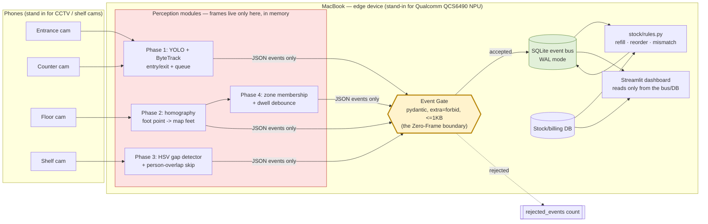

# Architecture

## Zero-Frame Architecture

The core privacy design: video frames are converted into small JSON events
entirely in memory, inside a perception module, and never leave it. Nothing
downstream of the event gate ever sees a pixel.

Everything inside the pink box (`Perception`) holds frames in memory only.
The only way out is through the Event Gate (yellow) — a schema validator that
whitelists 9 event shapes and rejects anything else, including any event
that happens to carry an image blob (tested explicitly in
`tests/test_event_gate.py`).

## Modules

- `storesmart/common/` — shared building blocks: event schema+gate, SQLite
  bus, video readers, YOLO+ByteTrack wrapper, geometry, privacy rendering,
  config loading. No phase-specific logic lives here.
- `storesmart/phase1_footfall/` — entry/exit counting and queue analytics.
- `storesmart/phase2_map/` — store map model, calibration, live map.
- `storesmart/phase3_shelf/` — shelf slot definitions and gap detection.
- `storesmart/stock/` — SQLite stock/billing schema, seeding, forecast, rules.
- `storesmart/phase4_dwell/` — zone dwell tracking, heatmap, insights.
- `storesmart/sim/` — synthetic data generators, one per phase, so every
  module has a `--simulate` mode.
- `storesmart/dashboard/` — Streamlit UI, reads only from the bus/DB.

## Why SQLite + a shared bus

One file (`data/storesmart.db`, WAL mode) is simple to demo, inspect, and
reset (`make reset-data`), and WAL mode lets the dashboard read while
modules write concurrently. `EventBus` is the only writer path for events;
`stock/db.py` owns its own tables in the same file for stock/billing.

## Production target

This demo runs entirely on a MacBook (Apple Silicon, `device="mps"` with
automatic CPU fallback), with phones standing in for CCTV/shelf cameras. The
production target for SIH26179 is an in-store edge box built on a Qualcomm
QCS6490 NPU — no code here is Qualcomm-specific; `make coreml` (Core ML
export) is the closest analogue in this repo to that deployment path.
